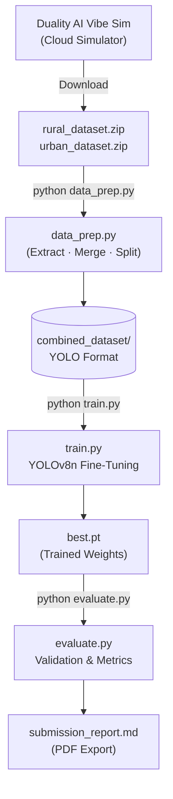

<div align="center">

# 🛸 Synthetic Drone Detection

### ECSoC 2026 · Duality AI Drone Detection Challenge · Phase 1: EO

*A complete sim-to-real drone detection pipeline that generates synthetic training data using Duality AI Vibe Sim, trains a YOLOv8 object detection model, and evaluates performance against real-world EO (Electro-Optical) imagery.*

[](https://python.org)
[](https://github.com/ultralytics/ultralytics)
[](https://pytorch.org)
[](https://duality.ai)
[](./LICENSE)

[🚀 Getting Started](#getting-started) · [🏗️ Architecture](#architecture) · [✨ Features](#features) · [📊 Results](#results)

</div>

---

## 🧠 What is this project?

This project was built for the **ECSoC 2026 Duality AI Drone Detection Challenge (Phase 1: EO)**.

> **How do you train an AI to detect drones in the real world — without using any real-world training data?**

This pipeline answers that question by using **Duality AI Vibe Sim** — a physics-accurate digital twin simulator — to generate fully synthetic, labeled drone imagery. The synthetic data is then used to train a **YOLOv8 Nano object detection model** that generalizes to real-world EO imagery.

The challenge addresses one of the hardest open problems in applied machine learning: the **Sim-to-Real gap** — the drop in performance when a model trained on synthetic data is tested on real images.

---

<a name="results"></a>

## 📊 Model Results (Phase 1 — EO Modality)

> Evaluated on a held-out validation split of **12 images (36 annotations)** generated from Duality AI Vibe Sim.

| Class | Images | Instances | Precision | Recall | mAP@0.50 ⭐ | mAP@0.50-0.95 |
|:---|:---:|:---:|:---:|:---:|:---:|:---:|
| **Drone (Class 0)** | 12 | 12 | **0.6020** | **0.5000** | **0.4630** | **0.3850** |
| **Bird (Class 1)** | 12 | 12 | 0.7160 | 0.4170 | 0.4970 | 0.4160 |
| **Manned Aircraft (Class 2)** | 12 | 12 | 0.4490 | 0.4170 | 0.2720 | 0.1890 |
| **All Classes (avg)** | 12 | 36 | 0.5889 | 0.4444 | 0.4105 | 0.3296 |

> ⭐ **mAP@0.50 is the primary competition evaluation metric.**

---

<a name="features"></a>

## ✨ Features

| Feature | Description |
|---|---|
| **Synthetic Data Generation** | Uses Duality AI Vibe Sim with custom pixel-on-target distribution matching real-world drone sizes |
| **Multi-Scenario Training** | Combines Rural (`Hackathon_RuralCUAS`) and Urban (`Hackathon_UrbanCUAS_ChangingWeather`) environments |
| **Clutter Modeling** | Enables birds (class 1) and manned aircraft (class 2) as distractors to reduce false positives |
| **Distribution Matching** | Uses `ieee_pixels_on_target.npy` to mirror real-world drone pixel-size distributions |
| **YOLOv8 Training** | Fine-tunes a pretrained `yolov8n.pt` model on fully synthetic labeled data |
| **Auto Dataset Prep** | `data_prep.py` extracts, merges, shuffles, and splits the datasets into YOLO format automatically |
| **Metrics Report** | `evaluate.py` outputs Precision, Recall, mAP@0.50, and mAP@0.50-0.95 with explanations |
| **CPU Compatible** | Runs entirely on CPU — no GPU required for training |

---

<a name="architecture"></a>

## 🏗️ Architecture

### How the Pipeline Works

```
Duality AI Vibe Sim (Cloud)
        ↓
rural_dataset.zip + urban_dataset.zip
        ↓
data_prep.py  ← Extracts, merges, splits 80/20
        ↓
combined_dataset/
  ├── images/train/   (48 images)
  ├── images/val/     (12 images)
  ├── labels/train/   (48 label files)
  ├── labels/val/     (12 label files)
  └── data.yaml
        ↓
train.py  ← Fine-tunes YOLOv8n for 15 epochs
        ↓
runs/detect/.../weights/best.pt
        ↓
evaluate.py  ← Outputs mAP@0.50, Precision, Recall
```

### System Data Flow



---

## 🛠️ Tech Stack

| Layer | Technology |
|---|---|
| **Data Generation** | Duality AI Vibe Sim (Falcon Platform), Natural Language Agent Prompts |
| **Object Detection** | Ultralytics YOLOv8 Nano (`yolov8n.pt`) |
| **Deep Learning** | PyTorch 2.12 |
| **Data Processing** | Python, NumPy, OpenCV, PyYAML |
| **Visualization** | Matplotlib (training curves, confusion matrix) |
| **Reporting** | Markdown → PDF (`submission_report.md`) |

---

## 📂 Directory Structure

```
synthetic-drone-detection/
├── data_prep.py              # Extract, merge, split and format datasets
├── train.py                  # YOLOv8 model training script
├── evaluate.py               # Evaluation and metrics reporting script
├── requirements.txt          # Python dependencies
├── submission_report.md      # Final submission report with metrics and links
│
├── combined_dataset/         # Auto-generated after running data_prep.py
│   ├── images/
│   │   ├── train/            # 48 training images (Rural + Urban)
│   │   └── val/              # 12 validation images
│   ├── labels/
│   │   ├── train/            # YOLO .txt label files
│   │   └── val/
│   └── data.yaml             # YOLO dataset config (paths + class names)
│
├── runs/                     # Auto-generated after running train.py
│   └── detect/
│       └── drone_detection_challenge/
│           └── yolov8_synthetic/
│               ├── weights/
│               │   ├── best.pt       # Best model checkpoint
│               │   └── last.pt       # Final epoch checkpoint
│               ├── results.png       # Training loss curves
│               ├── confusion_matrix.png
│               ├── BoxPR_curve.png   # Precision-Recall curve
│               └── BoxF1_curve.png   # F1-score curve
│
├── rural_dataset.zip         # Downloaded from Duality AI Vibe Sim
└── urban_dataset.zip         # Downloaded from Duality AI Vibe Sim
```

---

<a name="getting-started"></a>

## 🚀 Getting Started

### Prerequisites

- Python `3.9+`
- Internet connection (for downloading YOLOv8 base weights on first run)

### Setup

```bash
# 1. Clone the repository
git clone https://github.com/mayurigade-hub/synthetic-drone-detection.git
cd synthetic-drone-detection

# 2. Install dependencies
pip install -r requirements.txt
```

### Step 1 — Prepare the Dataset

Place your downloaded Vibe Sim zip files in the project root, then run:

```bash
python data_prep.py --rural_zip rural_dataset.zip --urban_zip urban_dataset.zip
```

Verify the structure was created correctly:
```bash
python data_prep.py --verify
```

### Step 2 — Train the Model

```bash
# CPU (default, works on any machine)
python train.py --epochs 15 --batch 4 --device cpu

# GPU (if CUDA is available — much faster)
python train.py --epochs 50 --batch 16 --device 0
```

### Step 3 — Evaluate the Model

```bash
python evaluate.py
```

Output will include Precision, Recall, mAP@0.50, and mAP@0.50-0.95 for each class.

---

## 📦 Training Datasets

All training data was generated using **Duality AI Vibe Sim**. No real-world data was used for training (per competition rules).

| Dataset | Scenario | Link |
|:---|:---|:---|
| Rural | `Hackathon_RuralCUAS` | [rural_dataset.zip](https://drive.google.com/file/d/1Y5E7rK1hseMnQ-UlXNbatjFPHPoGA1r7/view?usp=sharing) |
| Urban | `Hackathon_UrbanCUAS_ChangingWeather` | [urban_dataset.zip](https://drive.google.com/file/d/1Gkqqw8f7KUJ7qrDo4oJ98iG_XrKwzq-A/view?usp=sharing) |

---

## 📄 License

This project is licensed under the **MIT License**.

---

<div align="center">

*Built with Python, PyTorch, and Duality AI Vibe Sim.*

**ECSoC 2026 · Duality AI Drone Detection Challenge · Phase 1: EO**

</div>
